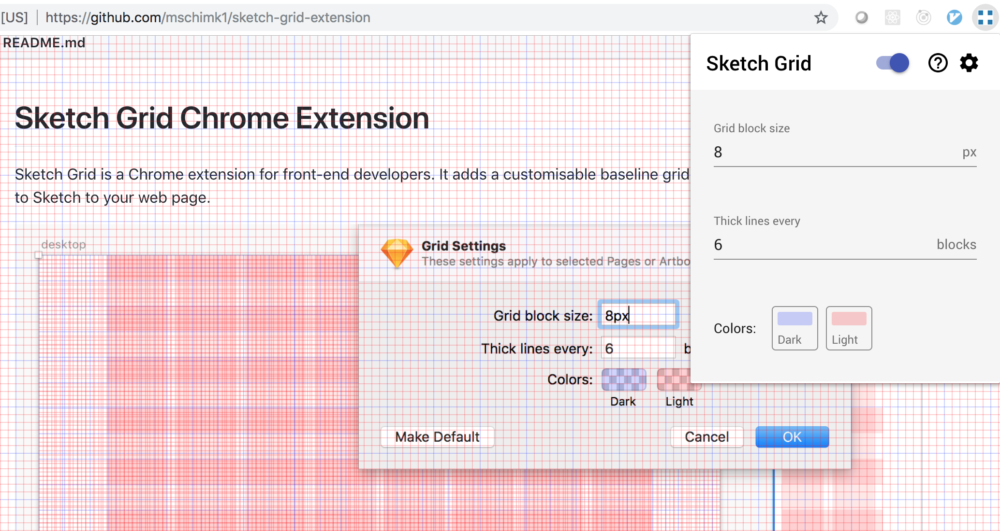

# Sketch Grid Chrome Extension

Sketch Grid is a Chrome extension for front-end developers. It adds a customisable baseline grid and layout settings similar to Sketch to your web page.

#### Sketch Grid Settings

#### Extension Grid Overlay Settings

This project is fairly new, but does the following already:

- [x] Switch turns the grid overlay on and off
- [x] Configurable grid options (options are currently stored globally)
- [x] Synchronizes extension popup, options and content pages
- [x] Default settings based on 8pt grid for the core structure of your page grid

> Note: This project was originally bootstrapped with [Create React App](https://github.com/facebook/create-react-app). It has since been ejected to support multiple Webpack entry points, and to remove the chunk hashes from build output filenames so that they can be referenced in the Chrome extension manifest file.

## Installation

Install via Git

- Clone the git repository to your local machine.
- Run `yarn install` and `yarn run build`
- Open Chrome and navigate to [Extensions](chrome://extensions/).
- Be sure the "Developer mode" switch is on and then click "Load unpacked" button.
- Navigate to the folder on your machine and press Select.
- Click the extension logo in the toolbar to activate the extension.
- Use the switch to toggle the grid overlay.
- Either click the settings cog, or navigate to the extension Options page to change grid settings.

## Development

In the project directory, you can run:

### `yarn start`

Runs the app in the development mode. 
Open [http://localhost:3000](http://localhost:3000) to view it in the browser.

The page will reload if you make edits. 
You will also see any lint errors in the console.

### `yarn test`

Launches the test runner in the interactive watch mode. 

### `yarn run build`

Builds the app for bundling to the `build` folder. 

## Ideas & Tasks

- [ ] Add Sketch layout settings
- [ ] Styling of extension views
- [ ] Add keyboard shortcuts
- [ ] Add Sketch Guides
- [ ] Help content tab
- [ ] E2E tests of extension views

## Credits & Inspiration

- This extension is based on [React Sketch Grid](https://blog.prototypr.io/using-sketchs-grid-in-react-35e67cf7e2d2) grid by Alonso Holmes. Thanks Alonso!
- [React Color](https://casesandberg.github.io/react-color/) for the Sketch color picker
- [8pt Material Design GUI Templates](https://medium.com/@_bklmn/8pt-gui-templates-ed8798badab3) by Joel Beukelman
- [The 8pt Grid: Consistent Spacing in UI Design with Sketch](https://blog.prototypr.io/the-8pt-grid-consistent-spacing-in-ui-design-with-sketch-577e4f0fd520) by Chris Godby
- [Creating Responsive Grid Templates with Sidebar Nav Panels in Sketch](https://medium.com/@touhey/creating-responsive-grid-templates-with-sidebar-nav-panels-in-sketch-31ecb629416c)

## Providing Feedback

Would love to hear [your feedback](https://github.com/mschimk1/sketch-grid-extension/issues).

## License

Unlicense
